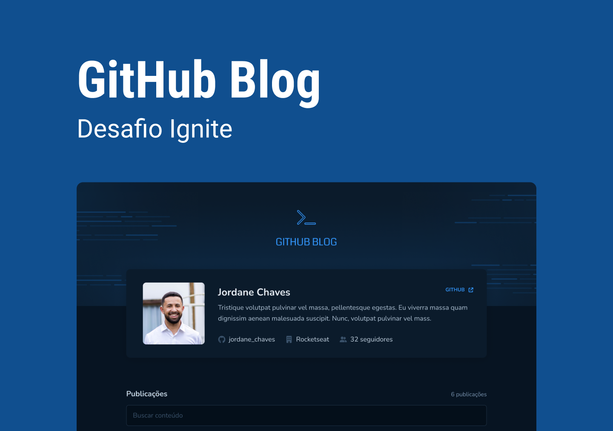

<h1 align="center">Github Blog</h1>
<p align="center">Ignite | ReactJS - Desafio Github Blog</p>

<p align="center">
  <a href="#-projeto">Projeto</a>&nbsp;&nbsp;&nbsp;|&nbsp;&nbsp;&nbsp;
  <a href="#-tecnologias">Tecnologias</a>&nbsp;&nbsp;&nbsp;|&nbsp;&nbsp;&nbsp;
  <a href="#-como-executar">Como Executar</a>&nbsp;&nbsp;&nbsp;|&nbsp;&nbsp;&nbsp;
  <a href="#-licença">Licença</a>&nbsp;&nbsp;&nbsp;|&nbsp;&nbsp;&nbsp;
  <a href="#-autor">Autor</a>
</p>

<p align="center">
  <a href="https://github.com/jordane-chaves/challenge-03-ignite-github-blog/blob/main/LICENSE">
    
  </a>
</p>

## 💻 Projeto

Github Blog é uma aplicação que busca os dados do perfil e issues de um repositório e exibe como um blog.

Durante o desenvolvimento da aplicação tive alguns desafios, como por exemplo:

- Para exibir o conteúdo da issue foi necessário transformar o conteúdo de markdown para HTML.
- A API do Github possui um limite de 10 requisições por minuto sem o cadastro de uma chave privada, este limite proporcionou muitos conhecimentos no React, pois tive que melhorar a performance da aplicação para não gerar tantas requisições para a API.

<p align="center">
  
</p>

## 🚀 Tecnologias

Esse projeto foi desenvolvido com as seguintes tecnologias:

- [TypeScript](https://www.typescriptlang.org/)
- [ReactJS](https://react.dev/)
- [Styled Components](https://styled-components.com/)
- [React Router Dom](https://reactrouter.com/)
- [Vite](https://vitejs.dev/)
- [react-markdown](https://remarkjs.github.io/react-markdown/)
- [use-context-selector](https://www.npmjs.com/package/use-context-selector)

## 🎲 Como executar

```bash
# Clone este repositório
$ git clone https://github.com/jordane-chaves/challenge-03-ignite-github-blog.git

# Acesse o diretório do projeto no terminal/cmd
$ cd challenge-03-ignite-github-blog

# Instale as dependências
$ npm install

# Execute a aplicação em modo de desenvolvimento
$ npm run dev

# A aplicação inciará na porta:5173 - acesse <http://localhost:5173>
```

## 📝 Licença

Esse projeto está sob a licença MIT - veja o arquivo [LICENSE](https://github.com/jordane-chaves/challenge-03-ignite-github-blog/blob/main/LICENSE) para mais detalhes.

## 👨🏻‍💻 Autor


Feito com 💜 por Jordane Chaves